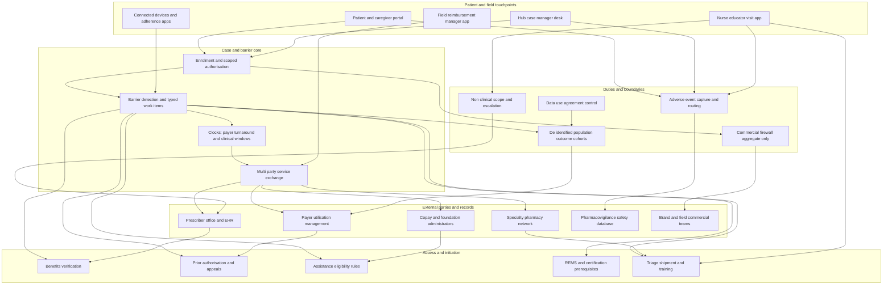

# Firstdose

**Source:** `ai-in-health/Accenture-Intelligent-Patient-Platform-Video-Transcript/`
**Domain:** `ai-health`
**One-liner:** A multi-party case system for manufacturer-sponsored patient support that turns every barrier between prescription and sustained therapy — benefits verification, prior authorisation, appeals, copay assistance, specialty pharmacy triage, injection training, refill lapse — into a typed work item with an owner and a clock, so time to first dose falls and persistence holds.
**Wedge:** Specialty and rare-disease therapies dispensed through a limited specialty pharmacy network with a manufacturer hub — biologics, cell and gene therapies, self-administered injectables, products under REMS — where a single prior-authorisation denial adds weeks to therapy start and abandonment risk compounds with every week the patient waits.
**Positioning:** Patient access and persistence run as case operations rather than as a CRM. Hub vendors operate these programmes on generic ticketing tools, fax and phone; the manufacturer receives a monthly deck of enrolment counts and cannot see where cases are stuck or for how long. Firstdose makes the *barrier* the primary object — typed, owned, clocked and shared across hub, specialty pharmacy, payer, prescriber office and nurse educator — with patient authorisation, the pharmacovigilance duty and the commercial firewall enforced at every hand-off.

## Market research synthesis

### Thesis from source

The source is a short 2015 video transcript for the Accenture Intelligent Patient Platform, and its value is in what it names as the unit of work rather than in its length. It opens on the claim that there is "an unprecedented opportunity to connect with patients and the healthcare system to deliver better health and economic outcomes," and that life sciences companies "can take a leading role in making these connections for the healthcare industry." The platform is described as helping those companies "become digital innovators through a fast, flexible and transformational technology suite that helps all parties involved in patient care make smarter decisions at speed and at scale." The pivotal sentence is the one that names the job precisely: "imagine a world where you can identify and remove barriers to improving patient care and provide precise, real-time support across the full patient experience." Barriers, and their removal — not campaigns, not engagement scores.

The transcript then enumerates exactly who has to move, and what each one needs. Patients should "get on a treatment program quickly, easily and get the support they need to manage their condition." Providers should "get increased support to achieve their patient care goals of quality, affordability, and engagement." Payers should be "able to easily collaborate with life sciences companies to better understand the impact that a treatment is having on the health and economic outcomes for patient populations." Pharmacies should "get the additional support needed to get patients on a therapy quickly and easily." Two of the four parties are defined purely in terms of speed to therapy, which is the metric the whole document orbits. The platform itself is described as built on secure, cloud-based technologies and more than twenty years of industry experience, with four integrated components — Patient Engagement, Insights and Analytics, Connected Devices and Applications, and Patient Data Management and Service Exchange — producing, from aggregated patient data across multiple parties plus health-application integration and outcome-based analytics, "a holistic view of individual and patient segment treatment journeys" that lets companies "measure the impact of their patient programs across all touchpoints to refine treatment effectiveness for each patient segment," and do it "often at a lower cost to serve."

Translating that into operations exposes where the value actually sits. "Service Exchange" is the most load-bearing phrase in the transcript and the least explained. In specialty therapy the parties already exchange work constantly — hub, specialty pharmacy, payer utilisation management, prescriber office, nurse educator, field reimbursement manager — and they do it by fax, portal and telephone, with each party holding a fragment of the case and nobody holding the clock. The barriers are concrete and enumerable: benefits verification incomplete; prior authorisation submitted, pending or denied; appeal window open and closing; copay card not applied or foundation funds exhausted; specialty pharmacy triage stalled on one missing prescription field; REMS enrolment outstanding; injection training unscheduled; shipment undelivered; first refill lapsed. Each of those is a typed work item with a payer-specific or clinically-specific clock, an owner who usually sits outside the manufacturer's walls, and a measurable contribution to abandonment. A holistic view of the treatment journey that cannot assign and clock those items is a picture of the problem rather than its removal.

What the transcript omits is what actually shapes the product. A manufacturer-sponsored support programme is not a care provider and everything it touches is regulated on that basis. The patient must give explicit, scoped, revocable authorisation before the manufacturer's agent may obtain or use their health information. Every patient contact carries a pharmacovigilance duty — any adverse event mentioned must be captured and routed to safety inside the regulatory clock, with serious cases inside 24 hours — and support programmes are a recognised and inspected source of case volume. Patient-level programme data must be firewalled from commercial targeting, which is precisely why the transcript's instinct toward *aggregated* patient data and population-level payer collaboration is the right one. Copay support and free goods carry anti-kickback and beneficiary-inducement exposure, so eligibility must run on published, auditable rules with government-insured patients typically excluded. Nurse educators employed by a manufacturer are not the patient's clinicians and must escalate rather than advise. Build the barrier-removal engine inside those constraints and the transcript's four promises — patients on therapy quickly, pharmacies supported, payers seeing population outcomes, at a lower cost to serve — stop being aspirations and become measurable operating targets.

### Buyer & economic model

- **Primary buyer:** VP or Head of Patient Services and Patient Access at a specialty pharma or biotech, co-sponsored by the brand's market access lead; at a rare-disease company the Chief Commercial Officer usually owns it directly.
- **Users:** hub case managers and patient access specialists (daily), field reimbursement managers working prescriber offices (daily), nurse educators and injection trainers (visit-based), specialty pharmacy intake and triage staff (daily, external), prescriber office benefit coordinators (external, intermittent), patients and caregivers (self-service), pharmacovigilance case intake (continuous), programme compliance and legal (monitoring and data-use agreements), payer partnership leads (population outcome reporting).
- **Budget owner / value metric:** the patient services budget, usually contracted to a hub vendor on a per-enrolment or per-case basis. The value metric is **median days from enrolment to first dose**, held together with 12-month persistence. Secondary metrics are abandonment before first fill, prior-authorisation first-pass approval and appeal overturn rates by payer, and cost to serve per patient sustained on therapy.
- **Competing status quo:** a hub vendor running the programme on a generic CRM or ticketing tool with fax and phone to payers and pharmacies, a copay vendor on a separate platform, a limited specialty pharmacy network reporting dispense data on a monthly lag, adherence addressed by refill-reminder texts, and the manufacturer receiving enrolment counts with no visibility into which barrier is holding which patient and for how long.

### Domain constraints

- **Regulatory / trust / safety:** a HIPAA authorisation is required before a manufacturer's agent may receive or use patient health information; it must be scoped, evidenced and revocable, and revocation must stop data sharing without stranding the patient mid-therapy. Pharmacovigilance duties attach to every patient and caregiver contact, with serious adverse events on a 24-hour clock, and programme case handling is directly inspectable. Copay assistance and free-goods programmes carry federal anti-kickback and beneficiary-inducement exposure, which is why government-insured patients are typically excluded and why eligibility must be rule-driven and auditable rather than discretionary. REMS-controlled products impose enrolment and certification prerequisites that gate dispensing entirely. Nurse educators contracted by a manufacturer operate inside a documented non-clinical scope and must escalate clinical questions to the prescriber rather than answer them.
- **Data sensitivity:** programme data is PHI, and the firewall between it and commercial targeting is a standing enforcement theme rather than an internal preference — patient-level records must be structurally unavailable to brand and field teams, with only aggregate segment views crossing. Payer collaboration of the kind the source describes must run on de-identified population outcomes under a signed data-use agreement with re-identification prohibited. Specialty pharmacy dispense data arrives under contract with use limitations attached. Authorisation state must be evaluated at every exchange with an external party, not captured once at enrolment and assumed thereafter.
- **Change-management realities:** the hub vendor operates the programme and employs the staff, so the system must make their agents faster rather than audit them into resistance, and vendor SLAs need to be expressible inside the tool. Specialty pharmacies will not adopt a manufacturer's workflow application, so the exchange has to meet them where they are — electronic where a standard exists, structured intake where it does not. Prescriber offices are the slowest link and the least incentivised; anything demanding more than a few minutes of their staff's time will simply not happen. And in a rare-disease population the patient count is small and every individual is visible, so a mishandled case is attributable in a way it never is in primary care.

## Business requirements

- BR-1: Every barrier between prescription and sustained therapy must exist as a typed work item with a named owner — internal or external — a due clock, and a recorded resolution, so that no case can stall invisibly.
- BR-2: Median days from enrolment to first dose must be the programme's headline metric, reported by barrier type and by payer, so that improvement effort targets the binding constraint rather than total case volume.
- BR-3: Patient authorisation must be scoped, evidenced and revocable, must be re-evaluated before every exchange with an external party, and revocation must halt data sharing without severing the patient's therapy support.
- BR-4: Any adverse event or product complaint surfaced in any patient or caregiver contact must be captured in that same contact and routed to pharmacovigilance inside the regulatory clock, with serious cases meeting the 24-hour deadline, and no contact may be closed while the duty is outstanding.
- BR-5: Patient-level programme data must be structurally unavailable to commercial and field teams; only aggregated segment views may cross the firewall, and every access attempt must be blocked and logged rather than filtered silently.
- BR-6: Financial assistance eligibility must be determined by published, auditable rules including the exclusion of government-insured patients where required, with no discretionary override outside a logged exception path.
- BR-7: Prior-authorisation and appeal work must be tracked against each payer's own turnaround requirements, with first-pass approval and overturn rates reported per payer so that access friction becomes negotiable evidence rather than anecdote.
- BR-8: Persistence must be managed as an operational obligation, with refill lapses, missed doses and dosing gaps raised as clocked work items on clinically meaningful windows rather than handled as marketing reminders.
- BR-9: Payer and health-system collaboration must run exclusively on de-identified population outcomes under an active data-use agreement, and must report against the health and economic measures the partnership actually committed to.
- BR-10: Every external party in a case — hub, specialty pharmacy, prescriber office, payer, assistance administrator — must be able to receive and return work through a structured exchange without adopting the manufacturer's internal tooling.
- BR-11: Programme cost to serve per patient sustained on therapy must be reported alongside speed and persistence, so that a faster programme cannot be mistaken for a better one when it is merely a more expensive one.
- BR-12: Programme staff and nurse educators must operate inside a documented non-clinical scope with defined escalation to the prescriber, and any out-of-scope request must be refused and routed rather than answered.

## User stories

Canonical user stories live in sibling [USER_STORIES.md](USER_STORIES.md).

## System design

### Overview

Firstdose runs the specialty therapy journey as a multi-party case. Enrolment creates a case carrying a scoped patient authorisation and a target first-dose date. A barrier engine continuously derives typed blockers from case state — benefits unverified, prior authorisation pending or denied, appeal window closing, assistance not applied or funds exhausted, triage stalled on a named field, REMS enrolment outstanding, training unscheduled, shipment undelivered, refill lapsed — and assigns each one to the party that can actually clear it, with a clock drawn from that payer's turnaround rules or the therapy's clinical window. Work crosses organisational boundaries through a service exchange that speaks whatever each external party supports, so specialty pharmacies and prescriber offices never have to adopt manufacturer tooling. Every patient or caregiver contact passes through a mandatory adverse-event capture step before it can close. Authorisation is re-evaluated at every external exchange rather than once at enrolment, and the commercial firewall is a hard boundary across which only aggregate segment views pass.

### Actors & boundaries

- **Actors:** patient and caregiver; hub case manager and patient access specialist; field reimbursement manager; nurse educator and injection trainer; specialty pharmacy intake and triage staff; prescriber and office benefit coordinator; payer utilisation management and appeals; copay card and foundation assistance administrators; pharmacovigilance case intake; programme compliance and legal; payer partnership lead; and the manufacturer's brand and field commercial teams, who sit outside the data boundary by design.
- **Trust boundary:** the patient authorisation is the boundary object. Firstdose holds the case, but every exchange with an external party is gated by the authorisation scope in force at that moment, and the manufacturer's commercial organisation sits entirely outside — it can read aggregate segment views and nothing else. Programme staff operate inside a documented non-clinical scope, escalating clinical questions to the prescriber rather than answering them. The specialty pharmacy remains authoritative for dispense and the payer for coverage; Firstdose owns the work item and the clock, not the clinical or claims truth.
- **Human-in-the-loop points:** authorisation capture, amendment and revocation; appeal composition and submission; assistance eligibility exception approval; nurse educator visit and escalation decisions; pharmacovigilance triage; refusal and routing of out-of-scope requests; data-use agreement approval before any payer cohort analysis is published.

### Core capabilities

1. **Enrolment and scoped authorisation** — authorisation captured, scoped, versioned, revocable, and re-evaluated at every external exchange.
2. **Barrier detection and typed work items** — blockers derived from case state with an owner, a clock and a recorded resolution.
3. **Multi-party service exchange** — structured routing to and from hub, specialty pharmacy, prescriber office, payer and assistance administrators, in whatever channel each supports.
4. **Benefits verification and coverage determination** — plan detection, benefit design, and the coverage pathway the case must follow.
5. **Prior authorisation and appeals** — submission, payer criteria attachment, denial reason capture, appeal clocks, and overturn tracking by payer.
6. **Financial assistance eligibility** — published rule evaluation with government-insurance exclusions and a logged, approved exception path.
7. **Therapy initiation logistics** — REMS and certification prerequisites, specialty pharmacy triage, shipment, and injection training scheduling.
8. **Persistence operations** — refill lapse, missed dose and dosing gap work items on clinically meaningful clocks.
9. **Pharmacovigilance capture and routing** — mandatory event question on every contact, serious-case 24-hour clock, and closure blocking until routing is confirmed.
10. **Commercial firewall and aggregate segment views** — hard boundary with aggregate-only crossing and blocked-access logging.
11. **Population outcome collaboration** — de-identified cohort outcome reporting to payer partners under an active data-use agreement.
12. **Programme performance and cost to serve** — time to first dose, abandonment, persistence, and cost per patient sustained on therapy.

### Conceptual data

- **Primary entities:** Patient, PatientCase, Authorisation, Barrier, WorkItem, ExchangePartner, PatientContact, BenefitsVerification, PriorAuthorisation, Appeal, AssistanceEligibility, RemsEnrolment, SpecialtyPharmacyTriage, Shipment, TrainingVisit, AdherenceEvent, AdverseEventReport, ScopeEscalation, PopulationOutcomeCohort, DataUseAgreement, FirewallEvent, ProgrammePerformanceMetric.
- **Critical events:** patient enrolled; authorisation captured, amended or revoked; benefits verified; prior authorisation submitted, approved or denied; appeal filed, overturned or upheld; assistance determined, awarded or exhausted; REMS enrolment completed; triage stalled and cleared; shipment dispatched, delivered or failed; training completed; first dose recorded; refill lapsed; dose missed; adverse event captured and routed; out-of-scope request refused and escalated; commercial access blocked; cohort outcome published.
- **Retention / audit needs:** authorisation versions are retained with the case for the programme's statutory life, so any past disclosure can be shown to have been authorised at the moment it occurred. Adverse event records follow pharmacovigilance retention, which in the EU runs to the product's life plus ten years. Assistance eligibility determinations and every logged exception are retained through the anti-kickback look-back and the term of any Corporate Integrity Agreement. Prior authorisation and appeal records are retained through the payer's appeal and audit windows. Patient-level clinical detail is retained only while the case is active plus the minimum statutory tail, after which it reduces to a de-identified outcome record. De-identified cohort outputs are retained under the data-use agreement's term with re-identification contractually and technically prohibited. Firewall events are retained for the full compliance monitoring period.

### Integrations (conceptual)

- **Systems of record:** the hub case management platform and its vendor systems; specialty pharmacy dispensing systems across the limited network; payer utilisation management and appeals portals plus electronic prior authorisation where available; copay card and foundation assistance administrators; the pharmacovigilance safety database; the prescriber's EHR where an integration exists and structured intake where it does not; the REMS administrator; the manufacturer's ERP for programme cost.
- **Upstream signals:** e-prescribing and enrolment forms; benefits and eligibility responses; contracted claims and pharmacy dispense feeds; connected device and adherence app data of exactly the kind the source's Connected Devices and Applications component describes, including injection device telemetry; patient-reported outcomes; payer policy and formulary updates; shipment tracking; REMS certification status; prescriber office availability.
- **Downstream actions:** work items pushed to the responsible external party through the exchange; prior authorisation and appeal packets to the payer; assistance enrolment to the administrator; triage clarifications to the specialty pharmacy naming the exact missing field; training visit scheduling to the nurse educator; pharmacovigilance case creation; status notifications to patient and caregiver; de-identified cohort outcome reports to the payer partner; programme performance and cost-to-serve reporting to the manufacturer.

### High-level architecture

The barrier engine sits at the centre because the barrier, not the patient record, is the thing the programme exists to remove. Around it, access and initiation services own the domain logic for each barrier type and its clock, while the service exchange handles the awkward reality that most of the people who can clear a barrier work for a different organisation and will not log into anything new. The duty layer runs across every path: authorisation gates each external exchange, adverse-event capture blocks contact closure, the commercial firewall lets only aggregates through, and no payer cohort is published without an active data-use agreement behind it.

### Success metrics

- **Leading:** median days from enrolment to first dose overall and decomposed by barrier type; count and age of open barriers by owning party; prior-authorisation first-pass approval and appeal overturn rates by payer; share of work items exchanged electronically rather than by fax or phone; assistance determinations made by published rule without exception; adverse events routed inside the clock and serious cases inside 24 hours; authorisation re-evaluation coverage at external exchange; blocked commercial access attempts; refill lapse work items resolved before the clinical gap window closes.
- **Lagging:** abandonment rate before first fill; six- and twelve-month persistence; share of patients whose therapy start met the target date; cost to serve per patient sustained on therapy; payer partnership cohorts meeting their committed health and economic outcomes; pharmacovigilance inspection findings on programme case handling; compliance findings on assistance eligibility; and retention of specialty pharmacies and prescriber offices as active participants in the exchange.

## OpenAPI skeleton

Canonical HTTP surface lives in sibling [openapi.yaml](openapi.yaml). Summary:

- **Base path:** `/v1/...`
- **Auth:** `X-API-Key` for exchange partners — specialty pharmacies, payer portals, assistance administrators, device feeds; Bearer JWT for hub staff, field reimbursement managers, nurse educators, patients and compliance users.
- **Resource groups:** Cases, Authorisation, Barriers, Exchange, Access, Initiation, Adherence, Safety, Boundaries, Outcomes, Reporting.
