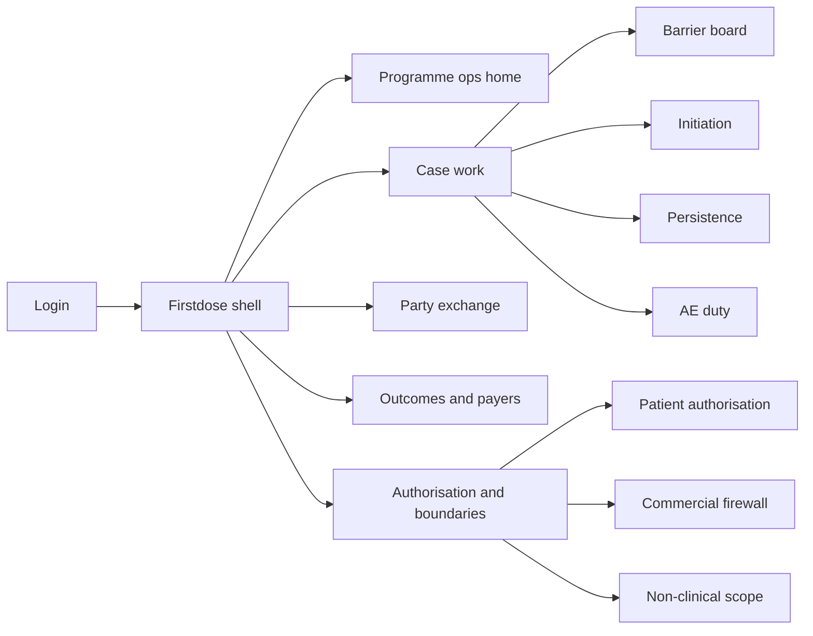
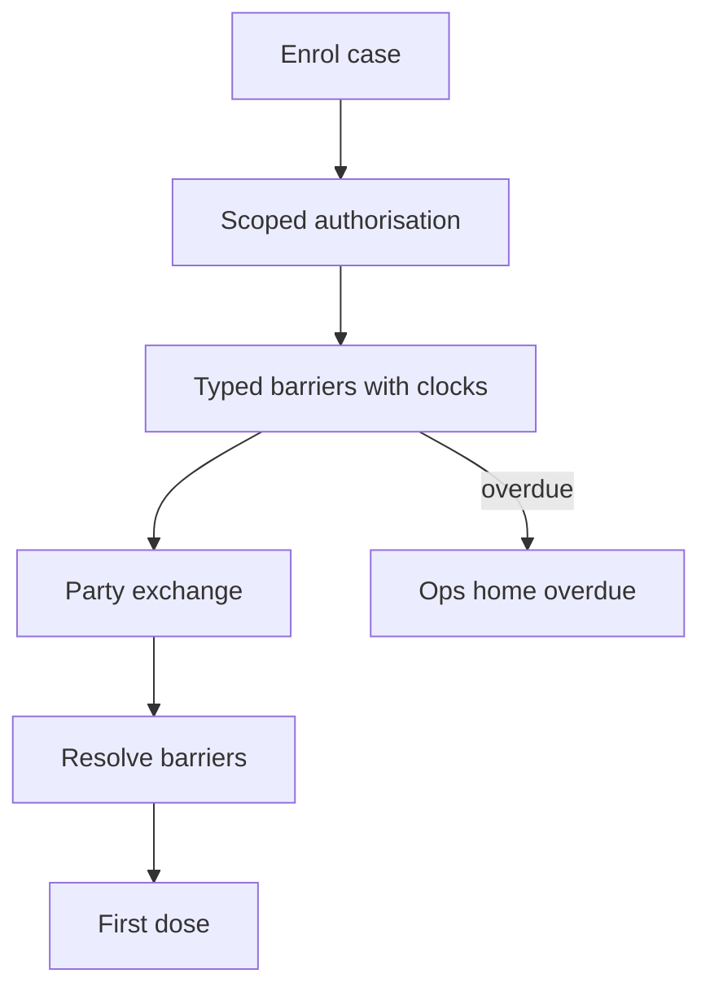

# Firstdose — Web app

**Product:** [PRODUCT.md](./PRODUCT.md)
**Primary surface:** Multi-party patient-support case ops console (hub + manufacturer programme shell)
**Secondary surfaces:** External party work exchange (specialty pharmacy, payer, clinic — structured, not full UI clone); commercial firewall-safe aggregate views; PV routing confirmations
**Design thesis:** Firstdose is a barrier-removal case system — not a patient-engagement marketing CRM and not a field-rep action engine. The metaphor is an air-traffic board for therapy start and persistence: every obstruction between prescription and sustained therapy is a typed, owned, clocked work item shared across parties, with patient authorisation re-checked before each external exchange. Visual language is therapy-path cyan and overdue coral on cool clinic white — median days to first dose is the hero metric; commercial users never see patient-level rows. The Firstdose wordmark sits on every case so “support” reads as operations with a pharmacovigilance duty, not a campaign.

## UX research synthesis

### Category peers (best-in-class)

- **Therigy / hub specialty platforms (e.g. AssistRx-class):** Enrolment-to-dispense workflows across hub and SP. Steal: barrier-typed work with owners outside the manufacturer; reject monthly enrolment decks without clocks.
- **CoverMyMeds / PA Hub patterns:** Payer-specific PA turnaround and status. Steal: track against each payer’s clock; report first-pass and overturn rates; reject opaque “submitted” statuses.
- **Salesforce Health Cloud / Service Cloud case orgs:** Multi-party case collaboration. Steal: structured external exchange without forcing tooling adoption; reject marketing journey builder as the primary object.
- **ArisGlobal / PV intake UIs:** AE capture with regulatory clocks. Steal: contact cannot close while PV duty outstanding; reject after-call spreadsheet AE entry.

### Patterns to adopt / reject

- **Adopt:** Barrier as primary object; median days to first dose by barrier/payer; scoped revocable authorisation re-evaluated per exchange; AE in-contact; commercial firewall with logged blocks; auditable financial assistance rules; persistence lapses as clocked work; de-identified payer outcomes; non-clinical scope with escalate-to-prescriber.
- **Reject:** Engagement scores as home; patient-level data for brand teams; discretionary copay overrides; purple “patient journey” maps without owners; fax-status as system of record.

### Trust, density, and workflow constraints from PRODUCT.md

No invisible stalls (BR-1). Headline metric = median days to first dose (BR-2). Authorisation scoped and re-checked (BR-3). AE/PV before close; serious ≤24h (BR-4). Commercial firewall (BR-5). Assistance rules auditable; government-insured exclusions (BR-6). PA/appeal vs payer clocks (BR-7). Persistence operational not marketing (BR-8). Payer collab de-identified under DUA (BR-9). External structured exchange (BR-10). Cost to serve beside speed (BR-11). Non-clinical scope enforced (BR-12).

## Information architecture

### Nav model

### Roles → default home

| Role | Default home | Why |
|------|--------------|-----|
| Hub case manager | Barrier board | Owned clocks (BR-1) |
| Nurse educator | Persistence + scope guard | Non-clinical escalate (BR-12) |
| Specialty pharmacy coordinator | Party exchange inbox | Structured work return (BR-10) |
| Field reimbursement / access | PA/appeal barriers | Payer clocks (BR-7) |
| Programme lead | Ops home — median days | BR-2, BR-11 |
| Pharmacovigilance | AE routing queue | BR-4 |
| Brand / commercial (aggregate only) | Segment outcomes | Firewall (BR-5) |
| Payer partner | De-identified outcomes | BR-9 |

### Cross-links to OpenAPI resources

| Nav area | OpenAPI tags / resources |
|----------|---------------------------|
| Case stages, enrolment | Cases |
| Scoped patient authorisation | Authorisation |
| Typed barriers, owners, clocks | Barriers |
| External party work exchange | Exchange |
| Benefits, PA, appeals, assistance | Access |
| Time to first dose | Initiation |
| Refill lapses, dosing gaps | Adherence |
| AE / complaint routing | Safety |
| Commercial firewall, non-clinical scope | Boundaries |
| Payer population outcomes | Outcomes |
| Cost to serve, programme metrics | Reporting |

## Screen inventory

### Programme ops home

- **Purpose:** Answer “where are patients stuck, and is speed improving without exploding cost to serve?”
- **Entry:** Programme lead default.
- **Layout regions:** Brand; median days to first dose by barrier type and payer; overdue barrier count; cost to serve per sustained patient; persistence lapse rate.
- **Primary actions:** Drill barrier type; open overdue; export ops pack.
- **Empty / loading / error:** New programme empty with enrolment CTA; never hide cost beside speed.
- **BR / story ties:** BR-2, BR-11.

### Case overview

- **Purpose:** One patient case with therapy stage, authorisation state, open barriers, parties involved.
- **Entry:** Search; barrier drill.
- **Layout regions:** Stage; auth status; barrier list; party roster; PV holds; scope warnings.
- **Primary actions:** Add barrier; request exchange; capture AE; escalate to prescriber.
- **Empty / loading / error:** Auth revoked = sharing halted, support path continues human-safe.
- **BR / story ties:** BR-1, BR-3, BR-4.

### Barrier board

- **Purpose:** Typed work items (BV, PA, appeal, copay, SP triage, REMS, training, shipment, refill lapse) with owner and due clock.
- **Entry:** Case managers default.
- **Layout regions:** Kanban or dense table by type; owner party; overdue coral; resolution log.
- **Primary actions:** Assign owner; resolve; reassign across parties; snooze only with policy.
- **Empty / loading / error:** Empty board = healthy with last activity time.
- **BR / story ties:** BR-1, BR-7, BR-8.

### Authorisation manager

- **Purpose:** Scoped, evidenced, revocable authorisation; re-evaluate before every external exchange.
- **Entry:** Case → Auth; before exchange send.
- **Layout regions:** Scopes granted; evidence; revoke; pre-exchange re-check gate.
- **Primary actions:** Capture auth; revoke; block exchange if invalid.
- **Empty / loading / error:** Missing auth blocks external send.
- **BR / story ties:** BR-3.

### Party exchange

- **Purpose:** Structured send/return of work to hub, SP, clinic, payer, assistance admin without requiring manufacturer tooling.
- **Entry:** Exchange nav; from barrier.
- **Layout regions:** Outbox/inbox; payload schema; due clocks; acknowledgement.
- **Primary actions:** Send work; accept return; escalate non-response.
- **Empty / loading / error:** Schema validation errors inline.
- **BR / story ties:** BR-10.

### Access and assistance

- **Purpose:** Benefits, PA/appeals against payer turnaround; financial assistance on published rules.
- **Entry:** Access barriers.
- **Layout regions:** Payer clock; first-pass/overturn stats; assistance eligibility engine; logged exception path only.
- **Primary actions:** Submit PA; open appeal; run eligibility; log exception.
- **Empty / loading / error:** Government-insured exclusion enforced where required (BR-6).
- **BR / story ties:** BR-6, BR-7.

### Initiation timeline

- **Purpose:** Enrolment → first dose with barrier contributions to elapsed days.
- **Entry:** From ops home drill; case.
- **Layout regions:** Timeline; barrier segments; median benchmarks.
- **Primary actions:** Focus binding constraint; export.
- **Empty / loading / error:** Pre-first-dose cases show live clocks.
- **BR / story ties:** BR-2.

### Persistence / adherence ops

- **Purpose:** Refill lapses, missed doses, gaps as clocked work — not marketing nudges.
- **Entry:** Adherence nav.
- **Layout regions:** Lapse queue; clinically meaningful windows; owner; resolution.
- **Primary actions:** Open barrier; escalate clinically via prescriber path.
- **Empty / loading / error:** Empty = publish persistence rate still.
- **BR / story ties:** BR-8, BR-12.

### Safety duty on contact

- **Purpose:** AE/product complaint capture in-contact; route PV; serious 24h; block close while outstanding.
- **Entry:** Any contact close; PV queue.
- **Layout regions:** Capture form; severity; routing confirmation; clock.
- **Primary actions:** Route; confirm; hold case close.
- **Empty / loading / error:** Outstanding duty banner unavoidable.
- **BR / story ties:** BR-4.

### Commercial firewall and aggregates

- **Purpose:** Block patient-level access for commercial; allow aggregated segments only; log attempts.
- **Entry:** Boundaries; commercial login lands here.
- **Layout regions:** Segment views; blocked attempt log; no case row affordance.
- **Primary actions:** View aggregates; export control events.
- **Empty / loading / error:** Attempt to open case = blocked + logged (BR-5).
- **BR / story ties:** BR-5.

### Payer outcomes collab

- **Purpose:** De-identified population outcomes under active DUA against committed measures.
- **Entry:** Outcomes nav.
- **Layout regions:** DUA status; committed measures; population charts; no patient drill.
- **Primary actions:** Publish period; renew DUA gate.
- **Empty / loading / error:** Expired DUA hides data.
- **BR / story ties:** BR-9.

### Non-clinical scope guard

- **Purpose:** Staff/nurse educator operate in documented scope; out-of-scope refused and routed to prescriber.
- **Entry:** On message/advice attempt.
- **Layout regions:** Allowed acts; refuse + route control; escalation record.
- **Primary actions:** Refuse and route; document.
- **Empty / loading / error:** Out-of-scope free-text blocked.
- **BR / story ties:** BR-12.

## Key flows

1. **Barrier to first dose** — enrol → auth → open barriers with owners/clocks → exchange with parties → resolve binding constraint → first dose; failure: invisible stall impossible — overdue surfaces on ops home.

2. **External exchange with auth re-check** — before send → re-evaluate auth → send structured work → receive return; revoke halts sharing without ending support.

3. **AE on contact** — capture → route PV → confirm (serious ≤24h) → then allow contact/case close.

4. **Assistance eligibility** — published rules → include/exclude → logged exception only path for overrides.

5. **Commercial access attempt** — brand user seeks patient case → block + log → offer aggregate segment only.

## Design system

### Tokens (CSS variables)

- `--color-ink: #1A2430` — primary text
- `--color-clinic: #F4F8FA` — app ground
- `--color-panel: #FFFFFF`
- `--color-path: #0E7C8A` — therapy path / on-track
- `--color-overdue: #C23B2E` — overdue barrier
- `--color-auth: #2F6B4F` — authorisation valid
- `--color-firewall: #5A4E7A` — commercial boundary
- `--color-brand: #0B4F5C` — Firstdose wordmark
- `--font-display: "Outfit", sans-serif` — median days hero numerals
- `--font-body: "IBM Plex Sans", sans-serif`
- `--font-mono: "IBM Plex Mono", monospace` — case ids, payer clocks, PV refs
- `--space-1`…`--space-8`: 4px scale
- `--radius-sm: 4px`; `--radius-md: 8px`
- `--motion-clock: 200ms linear` — barrier countdown
- `--motion-block: 150ms ease-out` — firewall block
- `--motion-dose: 220ms ease-out` — first-dose confirm
- Atmosphere: clean clinical ops; timeline path motif; no lifestyle patient stock heroes on ops home.

### Typography & brand

- Display for median days and cost to serve; body for barriers; mono for ids and clocks.
- Brand on ops home and every case header — stronger than any “engagement” title.
- Commercial aggregate shell: brand + “segment outcomes only” headline — no case list.

### Do / don’t

- **Do:** Clock every barrier; re-check auth; hold close for PV; firewall patient-level commercial access; show cost beside speed.
- **Don’t:** Journey maps without owners; marketing nudge centre as persistence; discretionary silent copay; purple patient-journey chrome.

### Accessibility & domain trust cues

- AA+; overdue not colour-only.
- Live regions for overdue promotions and PV clocks.
- Focus order on contact close: AE → auth → complete.
- External exchange payloads avoid unnecessary PHI fields (minimum necessary).

## Component patterns

- **BarrierWorkItem** — type, owner party, due clock, resolution.
- **MedianDaysHero** — by barrier type and payer.
- **AuthRecheckGate** — blocks exchange when invalid.
- **PartyExchangePacket** — structured send/return.
- **AssistanceRuleResult** — published eligibility + exception log.
- **PvDutyLock** — prevents close while outstanding.
- **CommercialFirewallBanner** — blocked patient-level access.
- **ScopeRefuseRoute** — out-of-scope → prescriber escalation.

## Out of scope for v1 web

- Consumer wellness social app; field promotional NBA (Onlabel); full EHR for prescribers; claims adjudication engine; building specialty pharmacy dispensing systems; selling patient-level data.
